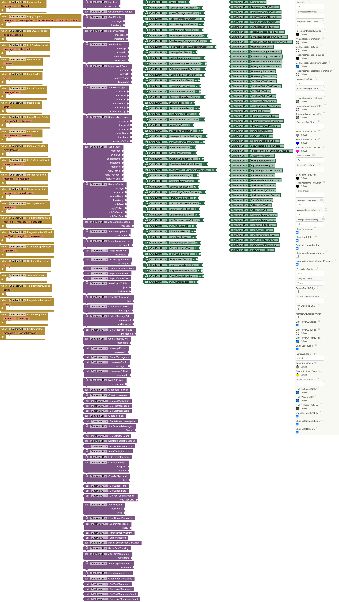

<h1><kbd>🧩 ChatKaroUI</kbd></h1>

ChatKaroUI is a `customizable advance chat component extension` text, images, reply, star, HTML/Markdown, export/import and more. 

<a href="https://community.appinventor.mit.edu/t/154865" target="_blank"><small><mark>Mit AI2 Community</mark></small></a> | <a href="https://community.kodular.io/t/301309" target="_blank"><small><mark>Kodular Community</mark></small></a>

## 📝 Specifications

---

🔎 **Use Place:** An extension for _`MIT App Inventor 2, Kodular, Niotron, Android Builder.`_  
👤 **Author:** Created by: [Prem_Gupta](https://community.appinventor.mit.edu/u/prem_gupta/summary)  
📦 **Package:** com.prem.chatkaroui  
💾 **Size:** 80 KB  
⚙️ **Version:** 3.2  
📱 **Minimum API Level:** 14  
📅 **Built On:** [date=2025-09-02 timezone="Asia/Kolkata"]  
📅 **Updated On:** [date=2026-03-30 timezone="Asia/Kolkata"]  
🔗 **Help URL:** [Telegram](https://www.telegram.me/Arungupta1526)  
💻 **Built & documented using:** [FAST](https://community.appinventor.mit.edu/t/fast-an-efficient-way-to-build-publish-extensions/129103?u=jewel) <small><mark>v5.7.1</mark></small>  
⬇️ **Aix:** [Download Link](./out/com.prem.chatkaroui.aix)  

---

## <kbd>Total Blocks of Extension:</kbd>

  

---

## <kbd>Events:</kbd>
**ChatKaroUI** has total 24 events.

### 1. MessageStarred
Fired when a message is starred or unstarred.

| Parameter | Type    |
| --------- | ------- |
| messageId | number  |
| isStarred | boolean |

### 2. ReplyTriggered
Fired when the user swipes a message to reply. Use messageId and messageText to populate your reply input field.

| Parameter     | Type    |
| ------------- | ------- |
| messageId     | number  |
| messageText   | text    |
| replyToSender | text    |
| avatarUrl     | text    |
| isSent        | boolean |

### 3. ReplyQuoteTapped
Fired when the user taps the reply-quote strip inside a message to scroll to the original.

| Parameter         | Type   |
| ----------------- | ------ |
| originalMessageId | number |

### 4. LinkPreviewLoaded
Fired when a link preview has been successfully loaded for a message.

| Parameter | Type   |
| --------- | ------ |
| messageId | number |
| title     | text   |
| url       | text   |

### 5. ExportSaved
Fired after SaveExportToFile succeeds.

| Parameter | Type |
| --------- | ---- |
| filePath  | text |

### 6. ExportFailed
Fired if SaveExportToFile fails.

| Parameter | Type |
| --------- | ---- |
| error     | text |

### 7. ImportCompleted
Fired when ImportChatFromJson finishes successfully.

| Parameter    | Type   |
| ------------ | ------ |
| messageCount | number |

### 8. ImportFailed
Fired if ImportChatFromJson fails.

| Parameter | Type |
| --------- | ---- |
| error     | text |

### 9. ImageAlreadyExists
Called when image already exists and was not re-saved.

| Parameter    | Type |
| ------------ | ---- |
| absolutePath | text |
| fileName     | text |

### 10. ImageSaved
Called when an image is saved successfully.

| Parameter    | Type |
| ------------ | ---- |
| absolutePath | text |
| fileName     | text |

### 11. ImageSaveFailed
Called when saving an image fails.

| Parameter    | Type |
| ------------ | ---- |
| errorMessage | text |

### 12. ProfilePictureClicked
Triggered when a profile picture is clicked.

| Parameter | Type |
| --------- | ---- |
| name      | text |
| avatarUrl | text |

### 13. MessageSelected
Triggered when a message is selected.

| Parameter | Type   |
| --------- | ------ |
| message   | text   |
| messageId | number |

### 14. MessageUpdated
Triggered when a message is updated.

| Parameter  | Type   |
| ---------- | ------ |
| messageId  | number |
| newMessage | text   |

### 15. MessageScrolledTo
Triggered when scroll to message completes.

| Parameter | Type   |
| --------- | ------ |
| messageId | number |

### 16. TextMenuItemClicked
Triggered when a text menu item is clicked.

| Parameter | Type   |
| --------- | ------ |
| itemText  | text   |
| message   | text   |
| messageId | number |

### 17. ImageMenuItemClicked
Triggered when an image menu item is clicked.

| Parameter | Type   |
| --------- | ------ |
| itemText  | text   |
| imageUrl  | text   |
| messageId | number |

### 18. ClipboardCopySuccess
Fired when text is successfully copied to clipboard.

| Parameter  | Type |
| ---------- | ---- |
| copiedText | text |

### 19. ClipboardCopyFailed
Fired when copying to clipboard fails.

| Parameter | Type |
| --------- | ---- |
| error     | text |

### 20. SelectionCleared
Triggered when selection is cleared.

### 21. TextMenuItemsAdded
Triggered when text menu items are added.

| Parameter | Type   |
| --------- | ------ |
| count     | number |

### 22. ImageMenuItemsAdded
Triggered when image menu items are added.

| Parameter | Type   |
| --------- | ------ |
| count     | number |

### 23. ForwardTriggered
Fired when the user taps Forward in the context menu.

| Parameter | Type   |
| --------- | ------ |
| messageId | number |
| message   | text   |

### 24. EditRequested
Fired when the user taps Edit in the context menu (sent messages only).

| Parameter      | Type   |
| -------------- | ------ |
| messageId      | number |
| currentMessage | text   |

## <kbd>Methods:</kbd>
**ChatKaroUI** has total 62 methods.

### 1. Initialize
Initialize the chat UI in a VerticalArrangement. Must be called before adding messages.

| Parameter   | Type      |
| ----------- | --------- |
| arrangement | component |

### 2. OnOrientationChanged
Call when screen orientation changes to reflow message bubbles.

### 3. SendSimple
Send a simple message without avatar or name.

| Parameter | Type |
| --------- | ---- |
| message   | text |
| timestamp | text |

### 4. ReceiveSimple
Receive a simple message without avatar or name.

| Parameter | Type |
| --------- | ---- |
| message   | text |
| timestamp | text |

### 5. SendWithAvatar
Send a message with avatar and sender name.

| Parameter  | Type |
| ---------- | ---- |
| message    | text |
| avatarUrl  | text |
| senderName | text |
| timestamp  | text |

### 6. ReceiveWithAvatar
Receive a message with avatar and sender name.

| Parameter    | Type |
| ------------ | ---- |
| message      | text |
| avatarUrl    | text |
| receiverName | text |
| timestamp    | text |

### 7. SendTextImage
Send a message with both text and image.

| Parameter    | Type    |
| ------------ | ------- |
| message      | text    |
| imageUrl     | text    |
| avatarUrl    | text    |
| senderName   | text    |
| timestamp    | text    |
| messageOnTop | boolean |

### 8. ReceiveTextImage
Receive a message with both text and image.

| Parameter    | Type    |
| ------------ | ------- |
| message      | text    |
| imageUrl     | text    |
| avatarUrl    | text    |
| receiverName | text    |
| timestamp    | text    |
| messageOnTop | boolean |

### 9. SendReply
Send a message as a reply to another message (shows a quote strip).

| Parameter     | Type    |
| ------------- | ------- |
| message       | text    |
| avatarUrl     | text    |
| senderName    | text    |
| timestamp     | text    |
| replyToId     | number  |
| replyToText   | text    |
| replyToSender | text    |
| replyToIsSent | boolean |

### 10. ReceiveReply
Receive a message as a reply to another message (shows a quote strip).

| Parameter     | Type    |
| ------------- | ------- |
| message       | text    |
| avatarUrl     | text    |
| senderName    | text    |
| timestamp     | text    |
| replyToId     | number  |
| replyToText   | text    |
| replyToSender | text    |
| replyToIsSent | boolean |

### 11. AddSystemMessage
Add a system message (e.g., 'User joined').

| Parameter | Type |
| --------- | ---- |
| message   | text |

### 12. StarMessageById
Star (bookmark) a message by its ID.

| Parameter | Type   |
| --------- | ------ |
| messageId | number |

### 13. UnstarMessageById
Unstar a previously starred message by its ID.

| Parameter | Type   |
| --------- | ------ |
| messageId | number |

### 14. ToggleStarById
Toggle the starred state of a message. Returns the new state.

* Return type: `boolean`

| Parameter | Type   |
| --------- | ------ |
| messageId | number |

### 15. IsMessageStarred
Returns true if the message with the given ID is starred.

* Return type: `boolean`

| Parameter | Type   |
| --------- | ------ |
| messageId | number |

### 16. GetStarredMessageIds
Returns a list of all currently starred message IDs.

* Return type: `list`

### 17. ExportChatAsJson
Export all chat messages as a JSON string. Store this string in a database or file to restore the chat later.

* Return type: `text`

### 18. ExportChatAsText
Export the chat as a plain-text transcript (human-readable).

* Return type: `text`

### 19. SaveExportToFile
Save exported JSON to a file in the chat-exports folder under ASD. Fires ExportSaved or ExportFailed.

| Parameter | Type |
| --------- | ---- |
| json      | text |
| fileName  | text |

### 20. ImportChatFromJson
Load a previously exported JSON string and restore all messages.

| Parameter | Type |
| --------- | ---- |
| json      | text |

### 21. DeleteMessageById
Delete a message by its ID.

| Parameter | Type   |
| --------- | ------ |
| messageId | number |

### 22. UpdateMessageById
Update an existing message's text by ID. Marks it as edited.

| Parameter  | Type   |
| ---------- | ------ |
| messageId  | number |
| newMessage | text   |

### 23. GetMessageTextById
Get the text of a message by its ID.

* Return type: `text`

| Parameter | Type   |
| --------- | ------ |
| messageId | number |

### 24. GotoMessageById
Smooth-scroll to a message by its ID.

| Parameter | Type   |
| --------- | ------ |
| messageId | number |

### 25. MessageExists
Returns true if a message with the given ID exists.

* Return type: `boolean`

| Parameter | Type   |
| --------- | ------ |
| messageId | number |

### 26. GetAllMessageIds
Get all active message IDs (excludes date headers and system messages).

* Return type: `list`

### 27. IsMessageSent
Returns true if the message was sent (false = received).

* Return type: `boolean`

| Parameter | Type   |
| --------- | ------ |
| messageId | number |

### 28. IsMessageEdited
Returns true if a message has been edited.

* Return type: `boolean`

| Parameter | Type   |
| --------- | ------ |
| messageId | number |

### 29. MarkAsEdited
Manually mark a message as edited without changing its content.

| Parameter | Type   |
| --------- | ------ |
| messageId | number |

### 30. CleanupIdTracking
Clean up internal ID tracking. Call after ClearAllMessages.

### 31. ClearAllMessages
Clear all chat messages.

### 32. GetMessageCount
Get the total count of chat messages (excluding system/date rows).

* Return type: `number`

### 33. GetFirstMessageId
Get the first (oldest) active message ID. Returns 0 if none.

* Return type: `number`

### 34. GetLastMessageId
Get the last (newest) active message ID. Returns 0 if none.

* Return type: `number`

### 35. ClearSelection
Clear all message selections.

### 36. GetSelectedMessageIds
Get a list of all currently selected message IDs.

* Return type: `list`

### 37. StarSelectedMessages
Star/Unstar all currently selected messages.

| Parameter | Type    |
| --------- | ------- |
| isStarred | boolean |

### 38. GetSelectedCount
Get the number of selected messages.

* Return type: `number`

### 39. DeleteSelectedMessages
Delete all currently selected messages.

### 40. IsMultiSelectionActive
Returns true if multi-selection mode is active.

* Return type: `boolean`

### 41. ShowTypingIndicator
Show typing indicator.

### 42. HideTypingIndicator
Hide typing indicator.

### 43. DownloadImage
Download an image from URL and save to chat-images folder. Fires ImageSaved, ImageAlreadyExists, or ImageSaveFailed.

| Parameter | Type |
| --------- | ---- |
| imageUrl  | text |
| format    | text |

### 44. CopyToClipboard
Copy text to clipboard.

| Parameter | Type |
| --------- | ---- |
| text      | text |

### 45. GetCurrentTime
Get current time formatted as hh:mm a.

* Return type: `text`

### 46. GetCurrentDate
Get current date formatted as dd-MM-yyyy.

* Return type: `text`

### 47. GetYouTubeThumbnail
Get YouTube thumbnail URL from a YouTube URL or video ID.

* Return type: `text`

| Parameter  | Type |
| ---------- | ---- |
| youTubeURL | text |

### 48. AddReaction
Add a reaction emoji to a message.

| Parameter | Type   |
| --------- | ------ |
| messageId | number |
| emoji     | text   |

### 49. InsertUnreadSeparator
Insert an 'Unread messages' separator at current position.

### 50. SearchMessages
Search messages containing query text. Returns list of matching IDs.

* Return type: `list`

| Parameter | Type |
| --------- | ---- |
| query     | text |

### 51. ArrangementWidthPx
Returns the width in pixels of the VerticalArrangement (or screen width).

* Return type: `number`

### 52. ScreenWidthPx
Returns the screen width in pixels.

* Return type: `number`

### 53. ResetTextMessageMaxWidth
Reset max width to 80% of screen width.

### 54. ResetDateTracking
Reset date-header tracking (useful when starting a fresh conversation).

### 55. AddTextMenuItems
Add custom text menu items (replaces existing custom items).

| Parameter | Type |
| --------- | ---- |
| menuItems | list |

### 56. AddImageMenuItems
Add custom image menu items (replaces existing custom items).

| Parameter | Type |
| --------- | ---- |
| menuItems | list |

### 57. ClearTextMenuItems
Clear custom text menu items.

### 58. ClearImageMenuItems
Clear custom image menu items.

### 59. GetTextMenuItems
Get current text menu items as a list.

* Return type: `list`

### 60. GetImageMenuItems
Get current image menu items as a list.

* Return type: `list`

### 61. GetTextMenuItemsCount
Get count of custom text menu items.

* Return type: `number`

### 62. GetImageMenuItemsCount
Get count of custom image menu items.

* Return type: `number`

## <kbd>Designer:</kbd>
**ChatKaroUI** has total 51 designer properties.

### 1. AvatarSize

* Input type: `non_negative_integer`
* Default value: `40`

### 2. TextMessageMaxWidth

* Input type: `non_negative_integer`
* Default value: `0`

### 3. ImageMessageMaxWidth

* Input type: `non_negative_integer`
* Default value: `0`

### 4. FullscreenImageBGColor

* Input type: `color`
* Default value: `0C0C0C`

### 5. AvatarBackgroundColor

* Input type: `color`
* Default value: `DDDDDD`

### 6. SentMessageTextColor

* Input type: `color`
* Default value: `FFFFFF`

### 7. ReceivedMessageTextColor

* Input type: `color`
* Default value: `000000`

### 8. SentMessageBackgroundColor

* Input type: `color`
* Default value: `0084FF`

### 9. ReceivedMessageBackgroundColor

* Input type: `color`
* Default value: `F0F0F0`

### 10. MessageFontSize

* Input type: `non_negative_integer`
* Default value: `16`

### 11. SystemMessageFontSize

* Input type: `non_negative_integer`
* Default value: `14`

### 12. SystemMessageTextColor

* Input type: `color`
* Default value: `888888`

### 13. SelectedMessageBgColor

* Input type: `color`
* Default value: `F9D3FF`

### 14. TypingIndicatorTextColor

* Input type: `color`
* Default value: `888888`

### 15. TimestampFontSize

* Input type: `non_negative_integer`
* Default value: `12`

### 16. TimestampTextColor

* Input type: `color`
* Default value: `888888`

### 17. SentStatusTextColor

* Input type: `color`
* Default value: `0000FF`

### 18. ReceivedStatusTextColor

* Input type: `color`
* Default value: `FF00FF`

### 19. SentStatusText

* Input type: `string`
* Default value: `✓✓`

### 20. ReceivedStatusText

* Input type: `string`
* Default value: `🚀`

### 21. SentNameTextColor

* Input type: `color`
* Default value: `000000`

### 22. ReceivedNameTextColor

* Input type: `color`
* Default value: `000000`

### 23. NameFontSize

* Input type: `non_negative_integer`
* Default value: `12`

### 24. MessageCornerRadius

* Input type: `float`
* Default value: `20.0`

### 25. MessageHorizontalPadding

* Input type: `non_negative_integer`
* Default value: `16`

### 26. MessageVerticalPadding

* Input type: `non_negative_integer`
* Default value: `12`

### 27. ShowTimestamp

* Input type: `boolean`
* Default value: `True`

### 28. ShowReadStatus

* Input type: `boolean`
* Default value: `True`

### 29. AutoLinkEnabledInChat

* Input type: `boolean`
* Default value: `True`

### 30. ShowMetadataInsideBubble

* Input type: `boolean`
* Default value: `False`

### 31. ImageWidthFixInTextImageMessage

* Input type: `boolean`
* Default value: `True`

### 32. CustomFontFamily

* Input type: `asset`

### 33. TypingIndicatorText

* Input type: `string`
* Default value: `Typing`

### 34. SquareBubbleEdge

* Input type: `boolean`
* Default value: `False`

### 35. SquareEdgeCornerRadius

* Input type: `float`
* Default value: `8.0`

### 36. HtmlEnabledInChat

* Input type: `boolean`
* Default value: `False`

### 37. MarkdownEnabledInChat

* Input type: `boolean`
* Default value: `False`

### 38. LinkPreviewEnabled

* Input type: `boolean`
* Default value: `True`

### 39. LinkPreviewBgColor

* Input type: `color`
* Default value: `F5F5F5`

### 40. LinkPreviewAccentColor

* Input type: `color`
* Default value: `0084FF`

### 41. ShowEditedLabel

* Input type: `boolean`
* Default value: `True`

### 42. EditedLabelText

* Input type: `string`
* Default value: `edited`

### 43. EditedLabelColor

* Input type: `color`
* Default value: `888888`

### 44. StarredIndicatorColor

* Input type: `color`
* Default value: `FFD700`

### 45. StarredIndicatorText

* Input type: `string`
* Default value: `★`

### 46. ReplyBubbleBgColor

* Input type: `color`
* Default value: `0084FF`

### 47. ReplyAccentColor

* Input type: `color`
* Default value: `0084FF`

### 48. ReplyPreviewTextColor

* Input type: `color`
* Default value: `444444`

### 49. SwipeToReplyEnabled

* Input type: `boolean`
* Default value: `True`

### 50. ShowDefaultMenuItems

* Input type: `boolean`
* Default value: `True`

### 51. ShowDateHeaders

* Input type: `boolean`
* Default value: `True`

## <kbd>Setters:</kbd>
**ChatKaroUI** has total 51 setter properties.

### 1. AvatarSize
Get avatar size in DP.

* Input type: `number`

### 2. TextMessageMaxWidth
Get max width for text messages in DP.

* Input type: `number`

### 3. ImageMessageMaxWidth
Get max width for image messages in DP.

* Input type: `number`

### 4. FullscreenImageBGColor
Sets or gets FullscreenImageBGColor.

* Input type: `number`

### 5. AvatarBackgroundColor
Sets or gets AvatarBackgroundColor.

* Input type: `number`

### 6. SentMessageTextColor
Sets or gets SentMessageTextColor.

* Input type: `number`

### 7. ReceivedMessageTextColor
Sets or gets ReceivedMessageTextColor.

* Input type: `number`

### 8. SentMessageBackgroundColor
Sets or gets SentMessageBackgroundColor.

* Input type: `number`

### 9. ReceivedMessageBackgroundColor
Sets or gets ReceivedMessageBackgroundColor.

* Input type: `number`

### 10. MessageFontSize
Sets or gets MessageFontSize.

* Input type: `number`

### 11. SystemMessageFontSize
Sets or gets SystemMessageFontSize.

* Input type: `number`

### 12. SystemMessageTextColor
Sets or gets SystemMessageTextColor.

* Input type: `number`

### 13. SelectedMessageBgColor
Sets or gets SelectedMessageBgColor.

* Input type: `number`

### 14. TypingIndicatorTextColor
Sets or gets TypingIndicatorTextColor.

* Input type: `number`

### 15. TimestampFontSize
Sets or gets TimestampFontSize.

* Input type: `number`

### 16. TimestampTextColor
Sets or gets TimestampTextColor.

* Input type: `number`

### 17. SentStatusTextColor
Sets or gets SentStatusTextColor.

* Input type: `number`

### 18. ReceivedStatusTextColor
Sets or gets ReceivedStatusTextColor.

* Input type: `number`

### 19. SentStatusText
Sets or gets SentStatusText.

* Input type: `text`

### 20. ReceivedStatusText
Sets or gets ReceivedStatusText.

* Input type: `text`

### 21. SentNameTextColor
Sets or gets SentNameTextColor.

* Input type: `number`

### 22. ReceivedNameTextColor
Sets or gets ReceivedNameTextColor.

* Input type: `number`

### 23. NameFontSize
Sets or gets NameFontSize.

* Input type: `number`

### 24. MessageCornerRadius
Sets or gets MessageCornerRadius.

* Input type: `number`

### 25. MessageHorizontalPadding
Sets or gets MessageHorizontalPadding.

* Input type: `number`

### 26. MessageVerticalPadding
Sets or gets MessageVerticalPadding.

* Input type: `number`

### 27. ShowTimestamp
Sets or gets ShowTimestamp.

* Input type: `boolean`

### 28. ShowReadStatus
Sets or gets ShowReadStatus.

* Input type: `boolean`

### 29. AutoLinkEnabledInChat
Sets or gets AutoLinkEnabledInChat.

* Input type: `boolean`

### 30. ShowMetadataInsideBubble
Sets or gets ShowMetadataInsideBubble.

* Input type: `boolean`

### 31. ImageWidthFixInTextImageMessage
Sets or gets ImageWidthFixInTextImageMessage.

* Input type: `boolean`

### 32. CustomFontFamily
Sets or gets CustomFontFamily.

* Input type: `text`

### 33. TypingIndicatorText
Sets or gets TypingIndicatorText.

* Input type: `text`

### 34. SquareBubbleEdge
Sets or gets SquareBubbleEdge.

* Input type: `boolean`

### 35. SquareEdgeCornerRadius
Sets or gets SquareEdgeCornerRadius.

* Input type: `number`

### 36. HtmlEnabledInChat
Enable rendering of HTML tags in message text.

* Input type: `boolean`

### 37. MarkdownEnabledInChat
Enable Markdown rendering in message text (bold, italic, code, links, etc.).

* Input type: `boolean`

### 38. LinkPreviewEnabled
Enable automatic link-preview cards for URLs in messages.

* Input type: `boolean`

### 39. LinkPreviewBgColor
Background color for link-preview cards.

* Input type: `number`

### 40. LinkPreviewAccentColor
Accent color for link-preview cards (top bar and site name).

* Input type: `number`

### 41. ShowEditedLabel
Show or hide the 'edited' label on updated messages.

* Input type: `boolean`

### 42. EditedLabelText
Text used for the edited label (default: 'edited').

* Input type: `text`

### 43. EditedLabelColor
Color for the edited label.

* Input type: `number`

### 44. StarredIndicatorColor
Color of the star indicator shown in the metadata row.

* Input type: `number`

### 45. StarredIndicatorText
Text/emoji shown as the star indicator (default: ★).

* Input type: `text`

### 46. ReplyBubbleBgColor
Background color of the reply-quote strip.

* Input type: `number`

### 47. ReplyAccentColor
Accent color of the reply-quote left border.

* Input type: `number`

### 48. ReplyPreviewTextColor
The color of the text preview inside the reply-quote.

* Input type: `number`

### 49. SwipeToReplyEnabled
Enable or disable swipe-to-reply gesture.

* Input type: `boolean`

### 50. ShowDefaultMenuItems
Show or hide default context-menu items (Reply, Star, Copy, Delete, Forward, Edit).

* Input type: `boolean`

### 51. ShowDateHeaders
Enable or disable all date headers (Today, Yesterday, etc.).

* Input type: `boolean`

## <kbd>Getters:</kbd>
**ChatKaroUI** has total 51 getter properties.

### 1. AvatarSize
Get avatar size in DP.

* Return type: `number`

### 2. TextMessageMaxWidth
Get max width for text messages in DP.

* Return type: `number`

### 3. ImageMessageMaxWidth
Get max width for image messages in DP.

* Return type: `number`

### 4. FullscreenImageBGColor
Sets or gets FullscreenImageBGColor.

* Return type: `number`

### 5. AvatarBackgroundColor
Sets or gets AvatarBackgroundColor.

* Return type: `number`

### 6. SentMessageTextColor
Sets or gets SentMessageTextColor.

* Return type: `number`

### 7. ReceivedMessageTextColor
Sets or gets ReceivedMessageTextColor.

* Return type: `number`

### 8. SentMessageBackgroundColor
Sets or gets SentMessageBackgroundColor.

* Return type: `number`

### 9. ReceivedMessageBackgroundColor
Sets or gets ReceivedMessageBackgroundColor.

* Return type: `number`

### 10. MessageFontSize
Sets or gets MessageFontSize.

* Return type: `number`

### 11. SystemMessageFontSize
Sets or gets SystemMessageFontSize.

* Return type: `number`

### 12. SystemMessageTextColor
Sets or gets SystemMessageTextColor.

* Return type: `number`

### 13. SelectedMessageBgColor
Sets or gets SelectedMessageBgColor.

* Return type: `number`

### 14. TypingIndicatorTextColor
Sets or gets TypingIndicatorTextColor.

* Return type: `number`

### 15. TimestampFontSize
Sets or gets TimestampFontSize.

* Return type: `number`

### 16. TimestampTextColor
Sets or gets TimestampTextColor.

* Return type: `number`

### 17. SentStatusTextColor
Sets or gets SentStatusTextColor.

* Return type: `number`

### 18. ReceivedStatusTextColor
Sets or gets ReceivedStatusTextColor.

* Return type: `number`

### 19. SentStatusText
Sets or gets SentStatusText.

* Return type: `text`

### 20. ReceivedStatusText
Sets or gets ReceivedStatusText.

* Return type: `text`

### 21. SentNameTextColor
Sets or gets SentNameTextColor.

* Return type: `number`

### 22. ReceivedNameTextColor
Sets or gets ReceivedNameTextColor.

* Return type: `number`

### 23. NameFontSize
Sets or gets NameFontSize.

* Return type: `number`

### 24. MessageCornerRadius
Sets or gets MessageCornerRadius.

* Return type: `number`

### 25. MessageHorizontalPadding
Sets or gets MessageHorizontalPadding.

* Return type: `number`

### 26. MessageVerticalPadding
Sets or gets MessageVerticalPadding.

* Return type: `number`

### 27. ShowTimestamp
Sets or gets ShowTimestamp.

* Return type: `boolean`

### 28. ShowReadStatus
Sets or gets ShowReadStatus.

* Return type: `boolean`

### 29. AutoLinkEnabledInChat
Sets or gets AutoLinkEnabledInChat.

* Return type: `boolean`

### 30. ShowMetadataInsideBubble
Sets or gets ShowMetadataInsideBubble.

* Return type: `boolean`

### 31. ImageWidthFixInTextImageMessage
Sets or gets ImageWidthFixInTextImageMessage.

* Return type: `boolean`

### 32. CustomFontFamily
Sets or gets CustomFontFamily.

* Return type: `text`

### 33. TypingIndicatorText
Sets or gets TypingIndicatorText.

* Return type: `text`

### 34. SquareBubbleEdge
Sets or gets SquareBubbleEdge.

* Return type: `boolean`

### 35. SquareEdgeCornerRadius
Sets or gets SquareEdgeCornerRadius.

* Return type: `number`

### 36. HtmlEnabledInChat
Enable rendering of HTML tags in message text.

* Return type: `boolean`

### 37. MarkdownEnabledInChat
Enable Markdown rendering in message text (bold, italic, code, links, etc.).

* Return type: `boolean`

### 38. LinkPreviewEnabled
Enable automatic link-preview cards for URLs in messages.

* Return type: `boolean`

### 39. LinkPreviewBgColor
Background color for link-preview cards.

* Return type: `number`

### 40. LinkPreviewAccentColor
Accent color for link-preview cards (top bar and site name).

* Return type: `number`

### 41. ShowEditedLabel
Show or hide the 'edited' label on updated messages.

* Return type: `boolean`

### 42. EditedLabelText
Text used for the edited label (default: 'edited').

* Return type: `text`

### 43. EditedLabelColor
Color for the edited label.

* Return type: `number`

### 44. StarredIndicatorColor
Color of the star indicator shown in the metadata row.

* Return type: `number`

### 45. StarredIndicatorText
Text/emoji shown as the star indicator (default: ★).

* Return type: `text`

### 46. ReplyBubbleBgColor
Background color of the reply-quote strip.

* Return type: `number`

### 47. ReplyAccentColor
Accent color of the reply-quote left border.

* Return type: `number`

### 48. ReplyPreviewTextColor
The color of the text preview inside the reply-quote.

* Return type: `number`

### 49. SwipeToReplyEnabled
Enable or disable swipe-to-reply gesture.

* Return type: `boolean`

### 50. ShowDefaultMenuItems
Show or hide default context-menu items (Reply, Star, Copy, Delete, Forward, Edit).

* Return type: `boolean`

### 51. ShowDateHeaders
Enable or disable all date headers (Today, Yesterday, etc.).

* Return type: `boolean`